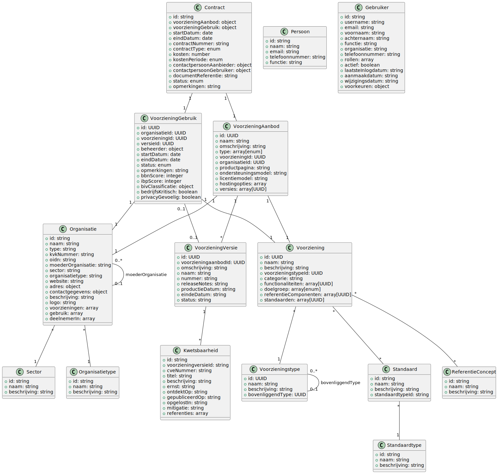

# Software Catalogus

De software catalogus is een verzameling van informatie over software die binnen de organisatie wordt gebruikt. Het biedt een overzicht van alle applicaties, systemen, en diensten die in gebruik zijn, inclusief details over hun functionaliteit, eigenaarschap, en relaties met andere systemen.

De Software Catalogus biedt een overzicht van software en diensten die beschikbaar zijn voor gemeenten en andere overheidsorganisaties. Het bevat informatie over leveranciers, voorzieningen, versies en kwetsbaarheden. Het datamodel is gebaseerd op het [Gemeenschappelijk Informatiemodel voor Voorzieningen (GIMV)](https://www.noraonline.nl/wiki/Gemeenschappelijke_Informatiemodel_voor_Voorzieningen) van NORA.

## Bedrijfsobjectenmodel Voorzieningen

Het onderstaande diagram toont het Bedrijfsobjectenmodel Voorzieningen, dat de basis vormt voor onze software catalogus. Dit model is afkomstig van de NORA (Nederlandse Overheid Referentie Architectuur) en toont de relaties tussen verschillende objecten in het domein van voorzieningen.

*Bron: [NORA Online - Bedrijfsobjectenmodel Voorzieningen](https://www.noraonline.nl/wiki/Bestand:Bedrijfsobjectenmodel_Voorzieningen.png)*

## Objecttypen

De Software Catalogus bestaat uit de volgende objecttypen:

- [Voorziening](./voorziening): Een ICT-voorziening die functionaliteit biedt aan gebruikers
- [VoorzieningAanbod](./voorzieningaanbod): Een specifiek aanbod van een voorziening door een aanbieder
- [VoorzieningGebruik](./voorzieninggebruik): Een organisatie die een voorziening gebruikt
- [Contract](./contract): Een formele overeenkomst voor het inzetten van een VoorzieningAanbod op een VoorzieningGebruik
- [VoorzieningVersie](./voorzieningversie): Specifieke versies van voorzieningaanbiedingen
- [Kwetsbaarheid](./kwetsbaarheid): Beveiligingsproblemen in voorzieningversies

## Ontbrekende objecten

Op basis van het Bedrijfsobjectenmodel Voorzieningen zijn de volgende objecten nog niet opgenomen in onze documentatie:

- Standaardtype: Type standaard waaraan een voorziening kan voldoen
- Standaard: Een specifieke standaard waaraan een voorziening kan voldoen
- ReferentieConcept: Concepten uit de referentiearchitectuur
- Sector: Sector waartoe een organisatie behoort
- Review: Beoordeling van een voorziening

## Object Relaties

De objecten in de Software Catalogus hebben de volgende relaties met elkaar:

- **Organisatie** biedt één of meerdere **VoorzieningAanbiedingen** aan
- **Voorziening** wordt aangeboden als één of meerdere **VoorzieningAanbiedingen**
- **VoorzieningAanbod** heeft één of meerdere **VoorzieningVersies**
- **VoorzieningVersie** kan één of meerdere **Kwetsbaarheden** bevatten
- **Organisatie** gebruikt één of meerdere **Voorzieningen** via **VoorzieningGebruik**
- **VoorzieningGebruik** kan gekoppeld zijn aan één of meerdere **Contract** objecten
- **Contract** verbindt een **VoorzieningAanbod** met een **VoorzieningGebruik**

## API Toegang

Je kunt deze objecten benaderen via de Software Catalogus API:

- `/organisaties` - Verkrijg alle organisaties
- `/voorzieningen` - Verkrijg alle voorzieningen
- `/voorzieningaanbiedingen` - Verkrijg alle voorzieningaanbiedingen
- `/voorzieningversies` - Verkrijg alle voorzieningversies
- `/kwetsbaarheden` - Verkrijg alle kwetsbaarheden
- `/gebruikers` - Verkrijg alle gebruikers
- `/voorzieninggebruik` - Verkrijg alle voorzieninggebruik
- `/contracten` - Verkrijg alle contracten

## Relatie tot PublicCode.yaml

De [publiccode.yaml](https://github.com/publiccodeyml/publiccode.yaml) standaard is een specificatie voor het beschrijven van publieke software. De Software Catalogus en publiccode.yaml hebben verschillende maar complementaire doelen:

| Software Catalogus | publiccode.yaml | Vergelijking |
|--------------------|-----------------|--------------|
| Gericht op gemeentelijke software | Gericht op publieke software in het algemeen | De Software Catalogus is specifieker gericht op de gemeentelijke context |
| Bevat informatie over commerciële en open source software | Primair gericht op open source software | De Software Catalogus heeft een bredere scope |
| Gedetailleerde informatie over leveranciers | Beperkte informatie over ontwikkelaars | De Software Catalogus biedt meer context over de commerciële aspecten |
| Bijhoudt meerdere versies en hun status | Beschrijft primair de huidige versie | De Software Catalogus biedt historische context |
| Bevat informatie over kwetsbaarheden | Geen expliciete ondersteuning voor kwetsbaarheden | De Software Catalogus biedt meer informatie over beveiliging | 