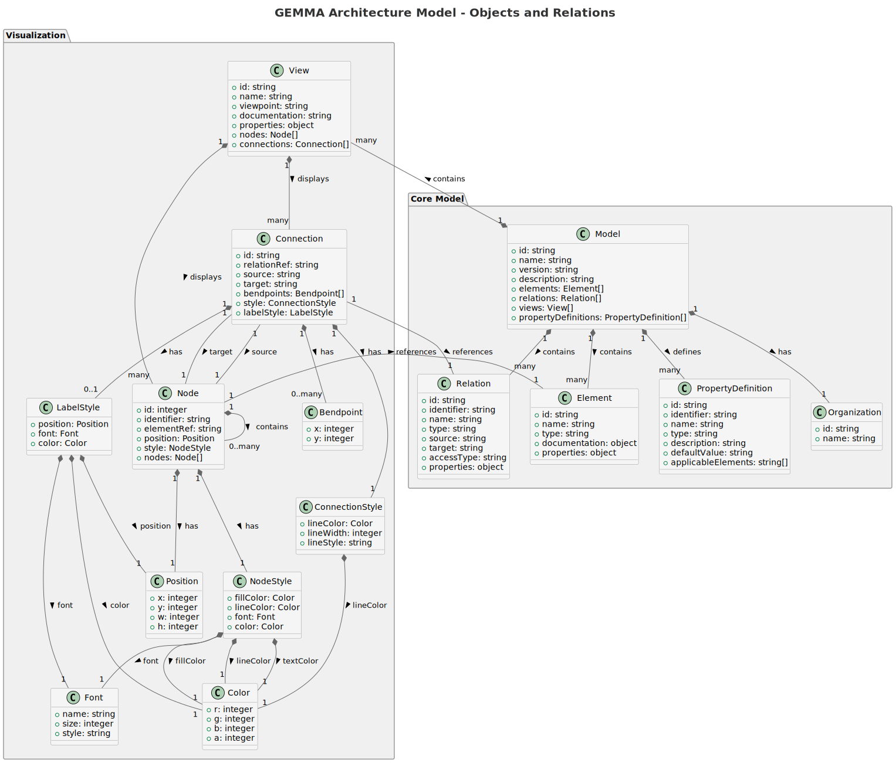
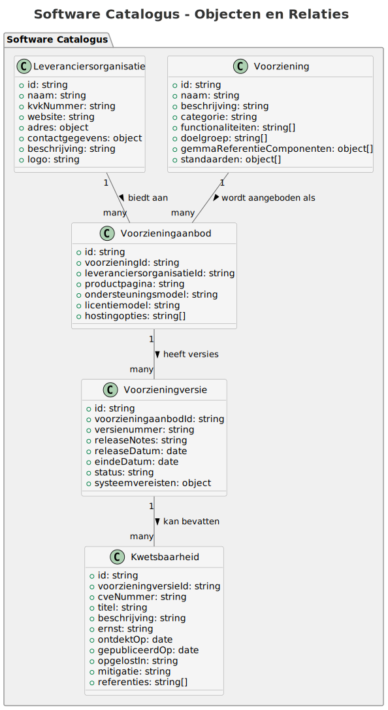

import Tabs from '@theme/Tabs';
import TabItem from '@theme/TabItem';

# GEMMA Architectuur Model Structuur

De GEMMA API biedt toegang tot een uitgebreid architectuurmodel dat de ArchiMate-standaard volgt, evenals een Software Catalogus met informatie over gemeentelijke software. Deze pagina legt de structuur van het model en de relaties tussen de componenten uit.

## GEMMA Architectuur Componenten

### Kern Componenten

Het GEMMA architectuurmodel bestaat uit verschillende kerncomponenten:

- [Model](model) - De hoofdcontainer die alle architectuurelementen, relaties, views en eigenschapsdefinities bevat
- [Elementen](elementen) - De bouwstenen van de architectuur (bedrijfsprocessen, applicaties, etc.)
- [Relaties](relaties) - De verbindingen tussen elementen
- [Views](views) - Verschillende perspectieven op het architectuurmodel
- [Eigenschapsdefinities](eigenschapsdefinities) - Definities van eigenschappen die aan elementen en relaties kunnen worden toegekend

### Visualisatie Componenten

Het model bevat componenten voor het visualiseren van de architectuur:

- [Nodes](nodes) - Visuele representaties van elementen in een diagram
- [Verbindingen](verbindingen) - Visuele representaties van relaties in een diagram

### Object Diagram

Het volgende diagram toont de structuur van het GEMMA architectuurmodel en de relaties tussen de componenten:

## Software Catalogus Componenten

Naast het architectuurmodel bevat de API ook toegang tot de Software Catalogus, die informatie biedt over gemeentelijke software:

- [Leveranciersorganisatie](leveranciersorganisatie) - Organisaties die software en diensten leveren
- [Voorziening](voorziening) - Softwareproducten en diensten voor gemeenten
- [Voorzieningaanbod](voorzieningaanbod) - Specifieke aanbiedingen van voorzieningen door leveranciers
- [Voorzieningversie](voorzieningversie) - Specifieke versies van voorzieningaanbiedingen
- [Kwetsbaarheid](kwetsbaarheid) - Beveiligingsproblemen in voorzieningversies

### Object Diagram

Het volgende diagram toont de structuur van de Software Catalogus en de relaties tussen de objecttypen:

Voor meer informatie over de Software Catalogus, zie de [Software Catalogus](softwarecatalogus) pagina.

## API Toegang

Je kunt deze componenten benaderen via de GEMMA API:

### GEMMA Architectuur Endpoints

- `/model` - Verkrijg het complete architectuurmodel
- `/elements` - Verkrijg alle architectuurelementen
- `/relations` - Verkrijg alle relaties tussen elementen
- `/views` - Verkrijg alle architectuurviews
- `/propertydefinitions` - Verkrijg alle eigenschapsdefinities

### Software Catalogus Endpoints

- `/leveranciersorganisaties` - Verkrijg alle leveranciersorganisaties
- `/voorzieningen` - Verkrijg alle voorzieningen
- `/voorzieningaanbiedingen` - Verkrijg alle voorzieningaanbiedingen
- `/voorzieningversies` - Verkrijg alle voorzieningversies
- `/kwetsbaarheden` - Verkrijg alle kwetsbaarheden

Voor gedetailleerde API documentatie, zie de [API Specificatie](/api). 