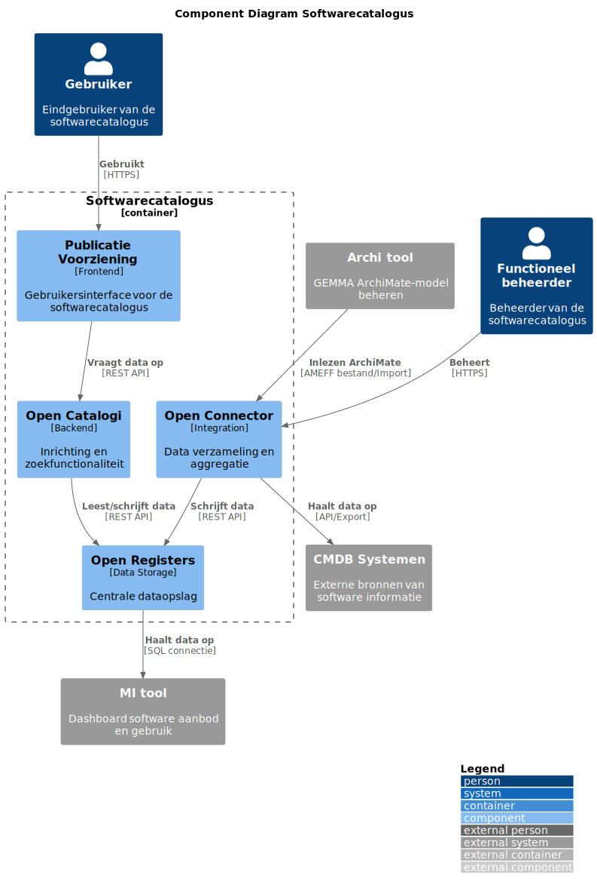
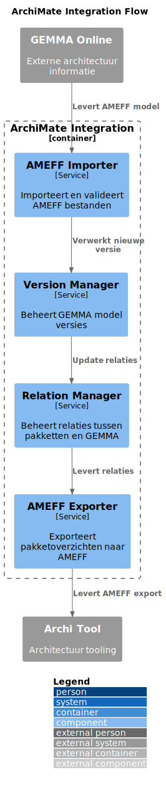

# Technische Architectuur

De Softwarecatalogus is opgebouwd uit verschillende Common Ground componenten die samen een complete oplossing vormen. Hieronder volgt een overzicht van de belangrijkste componenten en hun functies.

## Componenten

### Publicatie Voorziening (Frontend)
De frontend van de Softwarecatalogus wordt verzorgd door de Publicatie Voorziening. Deze component:
- Biedt een gebruiksvriendelijke interface voor eindgebruikers
- Zorgt voor een toegankelijke presentatie van de catalogusgegevens
- Implementeert de gebruikersinteractie en zoekfunctionaliteit
- Visualiseert GEMMA-views met ArchiMate symbolen
- Ondersteunt SVG export van architectuurviews
- Biedt interactieve definitieweergave (Glossary functionaliteit)

### Open Catalogi
Dit component is verantwoordelijk voor:
- Het inrichten van de catalogusstructuur
- Zoekfunctionaliteit en filtering
- Metadata management
- Categorisering en tagging van software
- GEMMA ArchiMate model importeren en verwerken
- Beheer van relaties tussen pakketten en GEMMA architectuur
- API voor GEMMA architectuurconcepten

### Open Registers
De datalaag wordt verzorgd door [Open Registers](https://openregisters.app), die:
- Fungeert als centrale dataopslag
- Beheert de basisregistraties van software en organisaties
- Zorgt voor data-integriteit en versioning
- Biedt een API voor data-toegang
- Slaat GEMMA architectuurconcepten op
- Beheert versies van het GEMMA ArchiMate model

### Open Connector
De [Open Connector](https://openconnector.app) component:
- Verzamelt data uit externe bronnen (zoals CMDB's)
- Aggregeert en transformeert data naar het juiste formaat
- Synchroniseert data tussen verschillende systemen
- Implementeert de benodigde koppelingen met externe systemen
- Verzorgt AMEFF import/export functionaliteit
- Koppelt met GEMMA Online voor detailinformatie

## Referentiearchitectuur Functionaliteit

### ArchiMate Integratie

De oplossing ondersteunt:
1. AMEFF bestandsimport (< 2 minuten voor 14MB)
2. Versie management van GEMMA modellen
3. Behoud van bestaande relaties bij updates
4. Automatische rollback bij importfouten
5. AMEFF export van pakketoverzichten en koppelingen.

### GEMMA Architectuur Ontsluiting
- JSON REST API voor GEMMA architectuurconcepten
- Zoek- en filterfunctionaliteit op archimate concepten 
- Linked Data API voor definities
- Directe koppelingen naar GEMMA Online
- Configureerbare basis-URLs voor verschillende omgevingen

### Visualisatie
- Interactieve GEMMA-views
- ArchiMate symbolenondersteuning
- SVG export functionaliteit
- Inzoombare views
- Hover-functionaliteit voor definities
- Consistente styling met GEMMA Online

## Interactie tussen Componenten

De componenten werken samen volgens Common Ground principes:
1. Data wordt bij de bron opgehaald
2. Componenten communiceren via gestandaardiseerde API's
3. Er is een duidelijke scheiding tussen data en functionaliteit

## GEMMA ArchiMate Model

De Softwarecatalogus maakt gebruik van het officiële GEMMA ArchiMate-model. Dit model is te vinden op de pagina [Download GEMMA ArchiMate-repository](https://www.gemmaonline.nl/index.php?title=Download_GEMMA_ArchiMate-repository). Hier de directe link naar het [GEMMA AMEFF bestand](https://github.com/VNG-Realisatie/GEMMA-Archi-repository/blob/master/export/GEMMA%20release.xml). Dit model:
- Is beschikbaar als AMEFF (ArchiMate Model Exchange File Format) export 
- Wordt regelmatig geactualiseerd en doorontwikkeld en gepubliceerd op github
- Bevat de complete GEMMA referentiearchitectuur
- Kan worden geïmporteerd in architectuurtools zoals Archi
- Onderzoekspuntje -> releasen vanaf github
- Het is bedoeling dat acceptatie op een andere versie van Gemma kan draaien dan Prod

### Ontwikkeltools
Voor het werken met ArchiMate modellen raden we de volgende tools aan:

#### Archi Tool
[Archi](https://www.archimatetool.com/) is een open source ArchiMate modelling tool die:
- Gratis te gebruiken is
- Beschikbaar is voor Windows, Mac en Linux
- AMEFF import/export ondersteunt
- Uitgebreide documentatie heeft
- Actief wordt onderhouden

Ga naar de GEMMA online pagina [ArchiMate modelleren](https://redactie.gemmaonline.nl/wiki/ArchiMate_modelleren) voor meer informatie en links.

#### GEMMA ArchiMate Repository
Het [GEMMA AMEFF bestand](https://github.com/VNG-Realisatie/GEMMA-Archi-repository/blob/master/export/GEMMA%20release.xml) kan worden gedownload om:
- De referentiearchitectuur te bestuderen
- De structuur van het AMEFF formaat te begrijpen
- Te testen met imports en exports
- Views en relaties te analyseren

Het model wordt gebruikt voor:
- Het importeren van nieuwe GEMMA releases
- Het koppelen van software aan referentiecomponenten
- Het exporteren van gemeentelijke architectuuroverzichten
- Het visualiseren van architectuurviews 

### Aanbevolen Ontwikkeltools
Voor het werken met ArchiMate modellen en andere ontwikkelactiviteiten raden we de volgende tools aan:

#### Cursor
[Cursor](https://cursor.com/) is een krachtige tool voor het beheren en visualiseren van gegevensmodellen.

#### Docker
[Docker](https://www.docker.com/) is een platform voor het ontwikkelen, verzenden en uitvoeren van applicaties in containers.

#### DBeaver
[DBeaver](https://dbeaver.io/) is een universele database tool voor ontwikkelaars en databasebeheerders.

#### OpenTestTools.com
[OpenTestTools.com](https://opentesttools.com/) biedt een verzameling van open source testtools voor verschillende testactiviteiten.

#### Free Accessibility Checker
[Free Accessibility Checker](https://freeaccessibilitychecker.skynettechnologies.com/?website=vng.opencatalogi.nl) is een online tool voor het controleren van de toegankelijkheid van websites.

## Gebruikte technologieën en princiepes

In dit project maken we gebruik van verschillende technologieën om een robuuste en schaalbare applicatie te bouwen. Hieronder vindt u een overzicht van de belangrijkste technologieën die we gebruiken, inclusief links naar de externe pagina's voor meer informatie.

- **PHP**: [PHP](https://www.php.net/) is een populaire server-side scripting taal die wordt gebruikt voor webontwikkeling.
- **Vue**: [Vue.js](https://vuejs.org/) is een progressief JavaScript-framework voor het bouwen van gebruikersinterfaces.
- **React**: [React](https://reactjs.org/) is een JavaScript-bibliotheek voor het bouwen van gebruikersinterfaces, ontwikkeld door Facebook.
- **NL Design System**: [NL Design System](https://designsystem.nl/) is een set van herbruikbare componenten en richtlijnen voor het ontwerpen van overheidswebsites.
- **Haven**: [Haven](https://haven.com/) is een platform voor het beheren en beveiligen van cloud-native applicaties.
- **REST API**: [REST API](https://restfulapi.net/) is een architecturale stijl voor het ontwerpen van netwerktoepassingen.
- **NL API Strategie**: [NL API Strategie](https://www.digitaleoverheid.nl/overzicht-van-alle-onderwerpen/api/landelijke-api-strategie/) is een strategie voor het ontwikkelen en gebruiken van API's binnen de Nederlandse overheid.
- **Gebruiker Centraal**: [Gebruiker Centraal](https://www.gebruikercentraal.nl/) is een community die zich richt op het centraal stellen van de gebruiker bij de ontwikkeling van overheidsdiensten.

## Gebruikte libraries

In dit project maken we gebruik van verschillende libraries voor zowel de frontend als de backend. Hieronder vindt u een overzicht van de gebruikte libraries, inclusief links naar de externe pagina's van de libraries en waar ze worden gebruikt (frontend/backend).

| Library | Link | Gebruik |
|---------|------|---------|
| @codemirror/lang-json | [@codemirror/lang-json](https://www.npmjs.com/package/@codemirror/lang-json) | Backend (vue) |
| @fortawesome/fontawesome-svg-core | [@fortawesome/fontawesome-svg-core](https://www.npmjs.com/package/@fortawesome/fontawesome-svg-core) | Backend (vue) |
| @fortawesome/free-solid-svg-icons | [@fortawesome/free-solid-svg-icons](https://www.npmjs.com/package/@fortawesome/free-solid-svg-icons) | Backend (vue) |
| @nextcloud/axios | [@nextcloud/axios](https://www.npmjs.com/package/@nextcloud/axios) | Backend (vue) |
| @nextcloud/dialogs | [@nextcloud/dialogs](https://www.npmjs.com/package/@nextcloud/dialogs) | Backend (vue) |
| @nextcloud/initial-state | [@nextcloud/initial-state](https://www.npmjs.com/package/@nextcloud/initial-state) | Backend (vue) |
| @nextcloud/l10n | [@nextcloud/l10n](https://www.npmjs.com/package/@nextcloud/l10n) | Backend (vue) |
| @nextcloud/router | [@nextcloud/router](https://www.npmjs.com/package/@nextcloud/router) | Backend (vue) |
| @nextcloud/vue | [@nextcloud/vue](https://www.npmjs.com/package/@nextcloud/vue) | Backend (vue) |
| @vueuse/core | [@vueuse/core](https://www.npmjs.com/package/@vueuse/core) | Backend (vue) |
| apexcharts | [apexcharts](https://www.npmjs.com/package/apexcharts) | Backend (vue) |
| axios | [axios](https://www.npmjs.com/package/axios) | Backend (vue) |
| bootstrap | [bootstrap](https://www.npmjs.com/package/bootstrap) | Backend (vue) |
| bootstrap-vue | [bootstrap-vue](https://www.npmjs.com/package/bootstrap-vue) | Backend (vue) |
| css-loader | [css-loader](https://www.npmjs.com/package/css-loader) | Backend (vue) |
| lodash | [lodash](https://www.npmjs.com/package/lodash) | Backend (vue) |
| pinia | [pinia](https://www.npmjs.com/package/pinia) | Backend (vue) |
| remark-cli | [remark-cli](https://www.npmjs.com/package/remark-cli) | Backend (vue) |
| remark-lint-list-item-indent | [remark-lint-list-item-indent](https://www.npmjs.com/package/remark-lint-list-item-indent) | Backend (vue) |
| remark-preset-lint-consistent | [remark-preset-lint-consistent](https://www.npmjs.com/package/remark-preset-lint-consistent) | Backend (vue) |
| remark-preset-lint-recommended | [remark-preset-lint-recommended](https://www.npmjs.com/package/remark-preset-lint-recommended) | Backend (vue) |
| style-loader | [style-loader](https://www.npmjs.com/package/style-loader) | Backend (vue) |
| vue | [vue](https://www.npmjs.com/package/vue) | Backend (vue) |
| vue-apexcharts | [vue-apexcharts](https://www.npmjs.com/package/vue-apexcharts) | Backend (vue) |
| vue-codemirror6 | [vue-codemirror6](https://www.npmjs.com/package/vue-codemirror6) | Backend (vue) |
| vue-draggable-plus | [vue-draggable-plus](https://www.npmjs.com/package/vue-draggable-plus) | Backend (vue) |
| vue-loader | [vue-loader](https://www.npmjs.com/package/vue-loader) | Backend (vue) |
| vue-loading-overlay | [vue-loading-overlay](https://www.npmjs.com/package/vue-loading-overlay) | Backend (vue) |
| vue-material-design-icons | [vue-material-design-icons](https://www.npmjs.com/package/vue-material-design-icons) | Backend (vue) |
| vue-template-compiler | [vue-template-compiler](https://www.npmjs.com/package/vue-template-compiler) | Backend (vue) |
| zod | [zod](https://www.npmjs.com/package/zod) | Backend (vue) |
| adbario/php-dot-notation | [adbario/php-dot-notation](https://packagist.org/packages/adbario/php-dot-notation) | Backend (php) |
| bamarni/composer-bin-plugin | [bamarni/composer-bin-plugin](https://packagist.org/packages/bamarni/composer-bin-plugin) | Backend (php) |
| elasticsearch/elasticsearch | [elasticsearch/elasticsearch](https://packagist.org/packages/elasticsearch/elasticsearch) | Backend (php) |
| guzzlehttp/guzzle | [guzzlehttp/guzzle](https://packagist.org/packages/guzzlehttp/guzzle) | Backend (php) |
| opis/json-schema | [opis/json-schema](https://packagist.org/packages/opis/json-schema) | Backend (php) |
| symfony/uid | [symfony/uid](https://packagist.org/packages/symfony/uid) | Backend (php) |
| symfony/yaml | [symfony/yaml](https://packagist.org/packages/symfony/yaml) | Backend (php) |
| twig/twig | [twig/twig](https://packagist.org/packages/twig/twig) | Backend (php) |
| @amsterdam/design-system-css | [@amsterdam/design-system-css](https://www.npmjs.com/package/@amsterdam/design-system-css) | Frontend (react) |
| @amsterdam/design-system-react | [@amsterdam/design-system-react](https://www.npmjs.com/package/@amsterdam/design-system-react) | Frontend (react) |
| @arktect-co/archimate-diagram-engine | [@arktect-co/archimate-diagram-engine](https://www.npmjs.com/package/@arktect-co/archimate-diagram-engine) | Frontend (react) |
| @conduction/archimate-diagram-engine | [@conduction/archimate-diagram-engine](https://www.npmjs.com/package/@conduction/archimate-diagram-engine) | Frontend (react) |
| @conduction/theme | [@conduction/theme](https://www.npmjs.com/package/@conduction/theme) | Frontend (react) |
| @emotion/react | [@emotion/react](https://www.npmjs.com/package/@emotion/react) | Frontend (react) |
| @gemeente-denhaag/components-react | [@gemeente-denhaag/components-react](https://www.npmjs.com/package/@gemeente-denhaag/components-react) | Frontend (react) |
| @joint/core | [@joint/core](https://www.npmjs.com/package/@joint/core) | Frontend (react) |
| @loadable/component | [@loadable/component](https://www.npmjs.com/package/@loadable/component) | Frontend (react) |
| @lottiefiles/react-lottie-player | [@lottiefiles/react-lottie-player](https://www.npmjs.com/package/@lottiefiles/react-lottie-player) | Frontend (react) |
| @nl-design-system-unstable/rotterdam-design-tokens | [@nl-design-system-unstable/rotterdam-design-tokens](https://www.npmjs.com/package/@nl-design-system-unstable/rotterdam-design-tokens) | Frontend (react) |
| @utrecht/component-library-react | [@utrecht/component-library-react](https://www.npmjs.com/package/@utrecht/component-library-react) | Frontend (react) |
| @utrecht/components | [@utrecht/components](https://www.npmjs.com/package/@utrecht/components) | Frontend (react) |
| blazy | [blazy](https://www.npmjs.com/package/blazy) | Frontend (react) |
| clsx | [clsx](https://www.npmjs.com/package/clsx) | Frontend (react) |
| dayjs | [dayjs](https://www.npmjs.com/package/dayjs) | Frontend (react) |
| dompurify | [dompurify](https://www.npmjs.com/package/dompurify) | Frontend (react) |
| file-saver | [file-saver](https://www.npmjs.com/package/file-saver) | Frontend (react) |
| focus-trap-react | [focus-trap-react](https://www.npmjs.com/package/focus-trap-react) | Frontend (react) |
| history | [history](https://www.npmjs.com/package/history) | Frontend (react) |
| html-react-parser | [html-react-parser](https://www.npmjs.com/package/html-react-parser) | Frontend (react) |
| ibantools | [ibantools](https://www.npmjs.com/package/ibantools) | Frontend (react) |
| jointjs | [jointjs](https://www.npmjs.com/package/jointjs) | Frontend (react) |
| libphonenumber-js | [libphonenumber-js](https://www.npmjs.com/package/libphonenumber-js) | Frontend (react) |
| mobx-react-lite | [mobx-react-lite](https://www.npmjs.com/package/mobx-react-lite) | Frontend (react) |
| mobx-react-router | [mobx-react-router](https://www.npmjs.com/package/mobx-react-router) | Frontend (react) |
| npm-run-all | [npm-run-all](https://www.npmjs.com/package/npm-run-all) | Frontend (react) |
| preact | [preact](https://www.npmjs.com/package/preact) | Frontend (react) |
| react-css-transition-replace | [react-css-transition-replace](https://www.npmjs.com/package/react-css-transition-replace) | Frontend (react) |
| react-focus-lock | [react-focus-lock](https://www.npmjs.com/package/react-focus-lock) | Frontend (react) |
| react-router | [react-router](https://www.npmjs.com/package/react-router) | Frontend (react) |
| react-router-dom | [react-router-dom](https://www.npmjs.com/package/react-router-dom) | Frontend (react) |
| react-select | [react-select](https://www.npmjs.com/package/react-select) | Frontend (react) |
| react-tabs | [react-tabs](https://www.npmjs.com/package/react-tabs) | Frontend (react) |
| react-tooltip | [react-tooltip](https://www.npmjs.com/package/react-tooltip) | Frontend (react) |
| react-transition-group | [react-transition-group](https://www.npmjs.com/package/react-transition-group) | Frontend (react) |
| rollbar | [rollbar](https://www.npmjs.com/package/rollbar) | Frontend (react) |
| svg-pan-zoom | [svg-pan-zoom](https://www.npmjs.com/package/svg-pan-zoom) | Frontend (react) |
